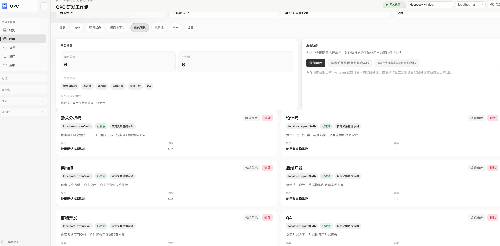
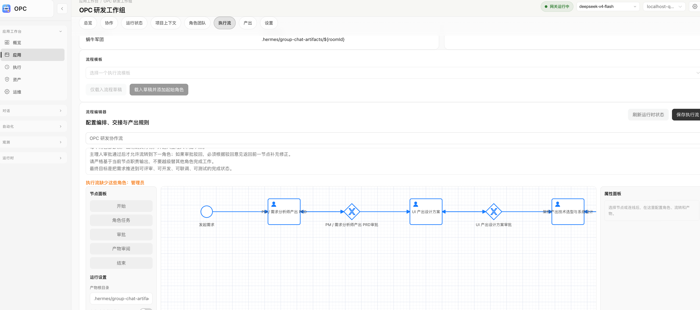

<p align="center">
  <strong>Workflow Agent Hub</strong>
  <a href="./README_zh.md">中文</a>
</p>

<p align="center">
  A multi-agent orchestration workspace for real execution flows.<br/>
  Manage applications, workflows, AI chat sessions, platform channels,<br/>
  scheduled jobs, skills, and runtime operations from one responsive interface.
</p>

<p align="center">
  <code>git clone git@github.com:iizhan/workflow-agent-hub.git</code>
</p>

<p align="center">
  
</p>

<p align="center">
  
</p>

<p align="center">
  <a href="https://github.com/iizhan/workflow-agent-hub">Private GitHub Repository</a>
</p>

---

## Features

### AI Chat

- Real-time streaming via SSE with async run support
- Multi-session management — create, rename, delete, switch between sessions
- **Self-built session database** — local SQLite storage with automatic sync from the runtime state.db on first startup
- Session grouping by source (Telegram, Discord, Slack, etc.) with collapsible accordion
- Active session indicator — live sessions pin to top with spinner icon
- Sessions sorted by latest message time
- Markdown rendering with syntax highlighting and code copy
- Tool call detail expansion (arguments / result)
- File upload support
- File download support — download user-uploaded files and agent-generated files across local, Docker, SSH, and Singularity backends
- Session search — Ctrl+K global search across all conversations
- Global model selector — discovers models from `~/.hermes/auth.json` credential pool
- Per-session model display badge and context token usage

### Platform Channels

Unified configuration for **8 platforms** in one page:

| Platform      | Features                                                               |
| ------------- | ---------------------------------------------------------------------- |
| Telegram      | Bot token, mention control, reactions, free-response chats             |
| Discord       | Bot token, mention, auto-thread, reactions, channel allow/ignore lists |
| Slack         | Bot token, mention control, bot message handling                       |
| WhatsApp      | Enable/disable, mention control, mention patterns                      |
| Matrix        | Access token, homeserver, auto-thread, DM mention threads              |
| Feishu (Lark) | App ID / Secret, mention control                                       |
| WeChat        | QR code login (scan in browser, auto-save credentials)                 |
| WeCom         | Bot ID / Secret                                                        |

- Credential management writes to `~/.hermes/.env`
- Channel behavior settings write to `~/.hermes/config.yaml`
- Auto gateway restart on config change
- Per-platform configured/unconfigured status detection

### Usage Analytics

- Total token usage breakdown (input / output)
- Session count with daily average
- Estimated cost tracking & cache hit rate
- Model usage distribution chart
- 30-day daily trend (bar chart + data table)

### Scheduled Jobs

- Create, edit, pause, resume, delete cron jobs
- Trigger immediate execution
- Cron expression quick presets

### Model Management

- Auto-discover models from credential pool (`~/.hermes/auth.json`)
- Fetch available models from each provider endpoint (`/v1/models`)
- Add, update, and delete providers (preset & custom OpenAI-compatible)
- OpenAI Codex & Nous Portal OAuth login
- Provider URL auto-detection for non-v1 API versions (e.g. `/v4`)
- Provider-level model grouping with default model switching

### Multi-Profile & Gateway

- Create, rename, delete, and switch between runtime profiles
- Clone existing profile or import from archive (`.tar.gz`)
- Export profile for backup or sharing
- Multi-gateway management — start, stop, and monitor gateway per profile
- Auto port conflict resolution
- Profile-scoped configuration and cache isolation

### File Browser

- Browse files on remote backends (local, Docker, SSH, Singularity)
- Upload, download, rename, copy, move, and delete files
- Create directories
- View file content with syntax highlighting

### Group Chat

- Multi-agent chat rooms with real-time messaging via Socket.IO
- @mention routing — mention an agent to trigger a contextual reply
- Context compression — automatic conversation summarization when history exceeds token threshold
- Typing status and reply progress indicators
- Room creation, deletion, and invite code management
- Agent management — add/remove agents from rooms with per-agent profiles
- SQLite message persistence
- Mobile responsive with collapsible sidebar

### Skills & Memory

- Browse and search installed skills
- View skill details and attached files
- User notes and profile management

### Logs

- View agent / gateway / error logs
- Filter by log level, log file, and keyword
- Structured log parsing with HTTP access log highlighting

### Authentication

- Token-based auth (auto-generated on first run or set via `AUTH_TOKEN` env var)
- Optional username/password login — set via settings page after initial token auth
- Auth can be disabled with `AUTH_DISABLED=1`

### Settings

- Display (streaming, compact mode, reasoning, cost display)
- Agent (max turns, timeout, tool enforcement)
- Memory (enable/disable, char limits)
- Session reset (idle timeout, scheduled reset)
- Privacy (PII redaction)
- Model settings (default model & provider)
- API server configuration

### Web Terminal

- Integrated terminal powered by node-pty and @xterm/xterm
- Multi-session support — create, switch between, and close terminal sessions
- Real-time keyboard input and PTY output streaming via WebSocket
- Window resize support

---

## Quick Start

### npm (Recommended)

```bash
git clone git@github.com:iizhan/workflow-agent-hub.git
cd workflow-agent-hub
pnpm install
pnpm dev
```

Open **http://localhost:8648**

### One-line Setup (Auto-detect OS)

Automatically installs Node.js (if missing) and bootstraps Workflow Agent Hub on Debian/Ubuntu/macOS:

```bash
bash <(curl -fsSL https://raw.githubusercontent.com/iizhan/workflow-agent-hub/main/scripts/setup.sh)
```

### WSL

```bash
bash <(curl -fsSL https://raw.githubusercontent.com/iizhan/workflow-agent-hub/main/scripts/setup.sh)
pnpm dev
```

> WSL auto-detects and uses `hermes gateway run` for background startup (no launchd/systemd).

### Docker Compose

Run the workspace together with the runtime agent service:

```bash
docker compose up -d --build hermes-agent hermes-webui
docker compose logs -f hermes-webui
```

Open **http://localhost:6060**

- Persistent runtime data is stored in `./hermes_data`
- Web UI auth token is stored in `./hermes_data/hermes-web-ui/.token`
- On first run with auth enabled, the token is printed to container logs
- All runtime settings are environment-variable driven in `docker-compose.yml`

For detailed notes and troubleshooting, see [`docs/docker.md`](./docs/docker.md).

### CLI Commands

| Command                           | Description                        |
| --------------------------------- | ---------------------------------- |
| `hermes-web-ui start`             | Start in background (daemon mode)  |
| `hermes-web-ui start --port 9000` | Start on custom port               |
| `hermes-web-ui stop`              | Stop background process            |
| `hermes-web-ui restart`           | Restart background process         |
| `hermes-web-ui status`            | Check if running                   |
| `hermes-web-ui update`            | Update to latest version & restart |
| `hermes-web-ui -v`                | Show version number                |
| `hermes-web-ui -h`                | Show help message                  |

### Auto Configuration

On startup the BFF server automatically:

- Validates `~/.hermes/config.yaml` and fills missing `api_server` fields
- Backs up original config to `config.yaml.bak` if modified
- Detects and starts the gateway if needed
- Resolves port conflicts (kills stale processes)
- Opens browser on successful startup

---

## Development

### Local Development & Debugging

```bash
git clone git@github.com:iizhan/workflow-agent-hub.git
cd workflow-agent-hub
npm install
npm run dev
```

`npm run dev` starts two processes:

- Vite frontend: http://localhost:5173/#/hermes/chat
- BFF server: http://localhost:8648 (detects/starts runtime gateways and proxies to the gateway for the selected profile)

For day-to-day local debugging, open `http://localhost:5173/#/hermes/chat`. Vite proxies local API traffic to the BFF:

- `/api/*`, `/v1/*`, `/health`, `/upload`, `/webhook` → `http://127.0.0.1:8648`
- `/socket.io` → `http://127.0.0.1:8648` (WebSocket)

Authentication is enabled by default. On first startup, the BFF terminal prints:

```text
Auth enabled — token: <your-token>
```

You can also read the local token file:

```bash
cat ~/.hermes-web-ui/.token
```

After you have the token, paste it on the login page or open:

```text
http://localhost:5173/?token=<your-token>#/hermes/chat
```

To temporarily disable auth while debugging:

```bash
AUTH_DISABLED=1 npm run dev
```

To debug frontend and backend separately:

```bash
npm run dev:server   # Koa BFF, default http://localhost:8648
npm run dev:client   # Vite frontend, default http://localhost:5173
```

Useful checks:

```bash
npm run build
npm run test
```

If port 8648 or 5173 is already in use, stop the older dev process first, or use `PORT=9000 npm run dev:server` for the BFF. If you change the BFF port, also update `BACKEND` in `vite.config.ts`.

### Local Production-like Run

To validate the built app locally:

```bash
npm run build
PORT=8648 node dist/server/index.js
```

Open **http://localhost:8648**. To validate the global CLI daemon flow from this checkout:

```bash
npm link
hermes-web-ui start
hermes-web-ui status
hermes-web-ui stop
```

### Repo-Isolated Local Run

When actively developing in this checkout, prefer an isolated Web UI data directory so the repo does not silently reuse `~/.hermes-web-ui` from another daemon or historical run:

```bash
npm run dev:isolated
```

For a built local validation, use the same isolation:

```bash
npm run build
HERMES_WEBUI_HOME=.runtime/.hermes-web-ui PORT=8648 node dist/server/index.js
cat .runtime/.hermes-web-ui/.token
```

The local CLI entry supports the same override:

```bash
HERMES_WEBUI_HOME=.runtime/.hermes-web-ui node ./bin/hermes-web-ui.mjs start
```

## Architecture

```
Browser → BFF (Koa, :8648) → Runtime Gateway (:8642)
                ↓
           Runtime CLI (sessions, logs, version)
                ↓
           ~/.hermes/config.yaml  (channel behavior)
           ~/.hermes/auth.json    (credential pool)
           Tencent iLink API      (WeChat QR login)
```

The frontend is designed with **multi-agent extensibility** — current runtime-specific code remains namespaced under `hermes/` directories (API, components, views, stores), making it straightforward to add new agent integrations alongside.

The BFF layer handles API proxy (with path rewriting), SSE streaming, file upload and download (multi-backend: local/Docker/SSH/Singularity), session CRUD via CLI, config/credential management, WeChat QR login, model discovery, skills/memory management, log reading, and static file serving.

## Tech Stack

**Frontend:** Vue 3 + TypeScript + Vite + Naive UI + Pinia + Vue Router + vue-i18n + SCSS + markdown-it + highlight.js

**Backend:** Koa 2 (BFF server) + node-pty (web terminal)

## Star History

Repository: https://github.com/iizhan/workflow-agent-hub

## Sponsor

如果你觉得这个项目对你有帮助，欢迎支持我：

<a href="https://ifdian.net/a/ekko8888"></a>

## License

[MIT](./LICENSE)
