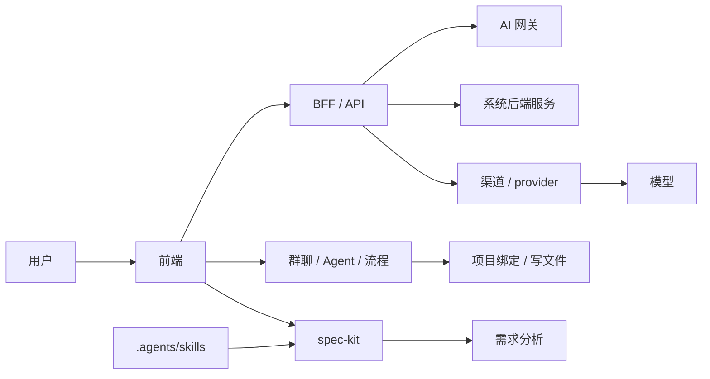

# Hermes Web UI Codex 团队开发说明

本项目已接入 `/Users/bing/MySelf/AI/SKILLS/Agents` 的项目级 Agent 底座。

项目级能力位于：

- `AGENTS.md`
- `.agents/skills`
- `.specify`
- `specs`

Spec Kit 命令入口：

- `pnpm spec:new -- "功能名称"`：创建 `specs/<编号>-<slug>/spec.md` 并更新当前 feature 指针。
- `pnpm spec:plan -- specs/001-feature`：为指定功能创建 `plan.md`；不传参数时使用 `.specify/feature.json` 的当前 feature。
- `pnpm spec:tasks -- specs/001-feature`：为指定功能创建 `tasks.md`；不传参数时使用当前 feature。
- `pnpm spec:checklist -- specs/001-feature requirements`：创建检查清单，默认文件为 `checklists/requirements.md`。
- `pnpm spec:doctor`：检查 `.specify/scripts/bash/*.sh` 脚本语法。

推荐流程：

1. `project-requirement-gate`
2. `speckit-specify`
3. `project-scope-impact-guard`
4. `project-hermes-domain-boundaries`
5. `project-codebase-onboarding`
6. `project-tech-solution`
7. `speckit-plan`
8. `speckit-tasks`
9. `speckit-analyze`
10. `speckit-implement`
11. `project-code-generation`
12. `project-stack-standards`
13. `project-frontend-testing`
14. `project-code-review`
15. `project-technical-writing`
16. `project-security-review`
17. `project-demand-memory`
18. `project-test-and-report`

分层原则：

- 通用流程规则放 `speckit-*`
- 项目特有规则放 `project-*`
- Hermes 产品边界由 `project-hermes-domain-boundaries` 维护
- 代码接手与读图由 `project-codebase-onboarding` 维护
- 复杂需求方案由 `project-tech-solution` 维护
- 实现阶段复用与分层由 `project-code-generation` 维护
- 前端自测由 `project-frontend-testing` 维护
- 合并前审查由 `project-code-review` 维护
- 文档与对外说明由 `project-technical-writing` 维护
- 高风险区域由 `project-security-review` 维护
- 需求沟通沉淀由 `project-demand-memory` 维护
- 当流程变化时，优先同步更新：
  - `AGENTS.md`
  - `.agents/skills/*`
  - `.specify/memory/constitution.md`
  - `.specify/templates/*.md`

Hermes 关键边界：

- AI 网关是 profile 的运行态，不等同于系统后端服务。
- 渠道/provider 是模型来源和密钥集合。
- 模型是渠道下可被选择的具体模型。
- 群聊 Agent 是房间成员，流程阶段应绑定已添加的 Agent。
- 项目绑定和 project-write 是真实文件写入路径，必须防止错误路径和整文件模板覆盖。

简化架构图：

