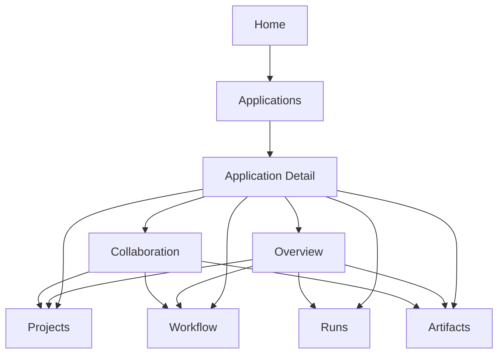

# 页面级线框与关键交互设计

## 1. 本轮目的

这份文档只解决两个问题：

- 关键页面的结构应该长什么样
- 用户在这些页面上的关键交互应该如何推进

本轮仍然不进入视觉实现代码，也不进入组件命名细节，只提供足够清晰的页面骨架与交互节奏，供后续 UI 实现和设计评审使用。

## 2. 本轮覆盖范围

本轮只覆盖最关键的入口与骨架页面：

- 首页
- 应用列表页
- 应用详情页
- 应用详情下的：
  - Overview
  - Projects
  - Workflow
  - Collaboration

不覆盖：

- 全量 System 页线框
- 全量 Resources 页线框
- 全部移动端细节
- 所有弹窗、抽屉与空态视觉稿

## 3. 页面设计总原则

### 原则 1：每一屏只能有一个主任务

每个页面都应清楚回答：

- 用户来这里最主要是做什么
- 这一屏最重要的 CTA 是什么

### 原则 2：先给上下文，再给操作

不要让用户先面对一堆按钮，而要先看到：

- 当前对象是什么
- 当前状态如何
- 下一步应该做什么

### 原则 3：应用详情是工作台，不是报表页

应用详情页不应像传统后台仪表盘那样把所有信息都塞在一屏里，而应强调：

- 状态
- 决策
- 下一步动作

### 原则 4：群聊退回到协作模块

聊天和群聊不再主导全局页面结构，只在需要协作推进时出现。

## 4. 首页线框

## 4.1 页面目标

首页要让用户快速进入工作，而不是配置系统。

### 首页主任务

- 进入已有应用
- 创建新应用
- 继续最近一次工作

## 4.2 推荐结构

```text
+----------------------------------------------------------------------------------+
| Top Shell                                                                       |
| Brand | Applications | Runs | Resources | System | Search | Profile            |
+----------------------------------------------------------------------------------+
| Hero / Work Entry                                                                |
| Title: "Build workspaces that move real projects forward"                       |
| Subtitle: short statement                                                        |
| [Create Application] [Browse Templates]                                         |
+--------------------------------------+-------------------------------------------+
| Recent Applications                  | Next Actions                              |
| app card                             | continue last run                         |
| app card                             | review pending artifact                   |
| app card                             | complete workflow setup                   |
+--------------------------------------+-------------------------------------------+
| Recent Artifacts                     | Recent Runs                               |
| artifact row                         | run row                                   |
| artifact row                         | run row                                   |
+----------------------------------------------------------------------------------+
| Templates / Start by Scenario                                                    |
| Code | Document | PPT | Research                                                |
+----------------------------------------------------------------------------------+
```

## 4.3 首页关键交互

### 交互 1：创建应用

- 主按钮放在首页 Hero 区
- 点击后进入“创建应用”向导，而不是直接打开一个空白表单页

### 交互 2：继续最近工作

- 首页应能识别用户最近一次活跃应用与运行
- 允许一键回到对应应用详情页或对应运行记录

### 交互 3：按场景起步

- “Code / Document / PPT / Research” 不直接跳系统页
- 应进入带模板预设的应用创建流程

## 4.4 首页状态要求

### 空状态

- 当用户没有应用时，首页要更像 onboarding，而不是空白控制台

### 活跃状态

- 当用户已有应用时，首页要更像工作入口，不必重复做产品介绍

## 5. 应用列表页线框

## 5.1 页面目标

这是用户管理全部工作台的目录页。

### 主任务

- 浏览应用
- 搜索和筛选应用
- 新建应用
- 进入应用

## 5.2 推荐结构

```text
+----------------------------------------------------------------------------------+
| Page Header                                                                      |
| Applications                                                     [Create App]    |
| Search | Filters: Type / Status / Updated / Owner                               |
+----------------------------------------------------------------------------------+
| View Switch: Comfortable / Compact / Board                                      |
+----------------------------------------------------------------------------------+
| Application List                                                                 |
| ------------------------------------------------------------------------------   |
| App Name     Goal Summary      Project     Agents  Last Run    Artifacts   >    |
| App Name     Goal Summary      Project     Agents  Last Run    Artifacts   >    |
| App Name     Goal Summary      Project     Agents  Last Run    Artifacts   >    |
| ------------------------------------------------------------------------------   |
+----------------------------------------------------------------------------------+
| Optional Right Rail                                                              |
| Recommended templates / Recently visited / Draft apps                           |
+----------------------------------------------------------------------------------+
```

## 5.3 关键交互

### 交互 1：快速筛选

- 至少支持：
  - 场景类型
  - 最近更新时间
  - 是否有待处理运行
  - 是否有待审产物

### 交互 2：快速进入

- 整行或整卡可点击进入应用详情
- 右侧箭头或 CTA 提示“进入工作台”

### 交互 3：快速新建

- 列表页顶部常驻 “Create Application”
- 不需要用户先回首页

## 5.4 应用项信息要求

每个应用项建议至少展示：

- 应用名称
- 一句话目标
- 场景类型
- 主项目名
- Agent 数量
- 最近运行时间
- 最近产物或异常状态

## 6. 应用详情总线框

## 6.1 页面目标

应用详情页是新产品最重要的工作台页面。

### 主任务

- 进入一个应用的完整上下文
- 查看当前状态
- 做下一步决策

## 6.2 推荐结构

```text
+----------------------------------------------------------------------------------+
| Top Shell                                                                       |
+----------------------------------------------------------------------------------+
| Application Header                                                               |
| App Name                 Scenario Tag   Status Badge                             |
| Goal summary                                                                    |
| [Start Run] [Open Workflow] [View Artifacts] [More]                             |
+----------------------------------------------------------------------------------+
| Local Navigation                                                                  |
| Overview | Projects | Agents | Workflow | Artifacts | Runs | Collaboration | Settings |
+----------------------------------------------------------------------------------+
| Main Content Area                                                                |
| depends on selected tab                                                          |
+----------------------------------------------------------------------------------+
```

## 6.3 应用详情关键交互

### 交互 1：主操作聚焦

头部始终只保留 2-3 个最重要操作：

- Start Run
- Open Workflow
- View Artifacts

不要把系统级配置按钮放在头部主操作区。

### 交互 2：局部导航稳定

应用内分区导航应稳定常驻，不要让用户频繁回全局导航切换。

### 交互 3：状态驱动操作

头部和 Overview 应根据状态给下一步建议：

- 未绑定项目 -> 去 Projects
- 未配置角色 -> 去 Agents
- 未配置流程 -> 去 Workflow
- 有待处理运行 -> 去 Runs
- 有待确认产物 -> 去 Artifacts

## 7. Overview 线框

## 7.1 页面目标

Overview 负责“让用户一眼理解当前应用处于什么状态，以及下一步该做什么”。

## 7.2 推荐结构

```text
+--------------------------------------+-------------------------------------------+
| Application Summary                  | Next Recommended Action                   |
| goal / scenario / owner              | card with one primary CTA                 |
+--------------------------------------+-------------------------------------------+
| Primary Project Status               | Workflow Status                           |
| connected / branch / sync            | current stage / readiness                 |
+--------------------------------------+-------------------------------------------+
| Active Agents                        | Recent Runs                               |
| role chips / status                  | latest runs list                          |
+--------------------------------------+-------------------------------------------+
| Recent Artifacts                     | Open Issues / Pending Reviews             |
| artifact cards                       | blockers / approval items                 |
+--------------------------------------+-------------------------------------------+
```

## 7.3 关键交互

### 交互 1：下一步推荐卡

Overview 必须有一个很明确的“下一步”卡片。

例如：

- 绑定主项目
- 完成角色配置
- 进入流程设计
- 启动第一次运行
- 审核待确认产物

### 交互 2：状态卡可跳转

Overview 上每个状态模块都应能跳到对应分区，而不是只是只读信息块。

## 8. Projects 线框

## 8.1 页面目标

让项目真正成为应用内一等公民，而不是一个群聊附属弹窗。

## 8.2 推荐结构

```text
+----------------------------------------------------------------------------------+
| Projects Header                                                   [Attach Project]|
+----------------------------------------------------------------------------------+
| Primary Project Card                                                               |
| name | local/remote | branch | repo | permissions | status                        |
| [Browse Files] [View Git] [Edit Binding]                                          |
+----------------------------------------------------------------------------------+
| Attached Projects (future-ready)                                                  |
| secondary project row                                                             |
+----------------------------------------------------------------------------------+
| Split View                                                                        |
| File Tree                                | File Preview / Git Summary             |
| folder/file list                         | content / status / branch summary      |
+----------------------------------------------------------------------------------+
```

## 8.3 关键交互

### 交互 1：绑定主项目

- 进入应用后的项目绑定应在这里完成
- 不再放在群聊入口内

### 交互 2：文件与 Git 双视图

- 页面默认应同时服务“看目录”和“看状态”
- 不要求一开始就提供重写式在线编辑

### 交互 3：未来扩展留口

- 现在就给“附属项目”留结构位，但可以先不完全开放

## 9. Workflow 线框

## 9.1 页面目标

让工作流成为应用内的正式业务模块，而不是房间配置附属项。

## 9.2 推荐结构

```text
+----------------------------------------------------------------------------------+
| Workflow Header                                                   [Edit Workflow] |
| current workflow name | version | status                                         |
+--------------------------------------+-------------------------------------------+
| Stage List / Structure Summary       | Flow Canvas Preview                       |
| stage 1                              | simplified graph / selected stage         |
| stage 2                              |                                           |
| stage 3                              |                                           |
+--------------------------------------+-------------------------------------------+
| Selected Stage Detail                                                            |
| owner role | trigger mode | approval | artifact requirement | model override     |
+----------------------------------------------------------------------------------+
```

## 9.3 关键交互

### 交互 1：先看摘要，再进编辑

- 默认不是直接打开完整编辑器
- 先让用户理解当前流程长什么样

### 交互 2：阶段详情驱动理解

- 点选某阶段后，应能看到：
  - 负责角色
  - 是否需要审批
  - 是否要求产物
  - 是否覆盖模型策略

### 交互 3：从应用上下文进入流程

- 用户应从应用出发看流程，而不是先进入一个独立流程系统

## 10. Collaboration 线框

## 10.1 页面目标

保留实时协作与群聊推进能力，但不再让其主导整个产品。

## 10.2 推荐结构

```text
+--------------------------------------+-------------------------------------------+
| Rooms / Members / Active Context     | Message / Collaboration Stream            |
| current room                         | threaded stream                           |
| participants                         | system notices                            |
| workflow context                     | mentions / updates                        |
+--------------------------------------+-------------------------------------------+
| Context Side Panel                                                               |
| linked project | active run | current stage | recent artifacts                    |
+----------------------------------------------------------------------------------+
```

## 10.3 关键交互

### 交互 1：协作上下文可见

- 当前协作必须能看见：
  - 属于哪个应用
  - 对应哪个项目
  - 当前流程走到哪
  - 相关产物是什么

### 交互 2：系统通知与人类消息分层

- 群聊流中系统通知、流程推进消息、普通对话应有明显区分

### 交互 3：从协作跳回工作

- 用户应能从协作消息一键跳去：
  - 项目文件
  - 工作流阶段
  - 相关产物

## 11. 页面间跳转主线

推荐的关键跳转链路如下：



## 12. 本轮结论

页面级线框层最重要的结论是：

- 首页负责“开始工作”
- 应用列表页负责“管理工作台”
- 应用详情页负责“进入具体工作”
- Overview 负责“判断状态与下一步”
- Projects / Workflow / Collaboration 各自承担清晰业务任务

只要后续页面实现偏离这条主线，就说明已经脱离本轮设计结论。
