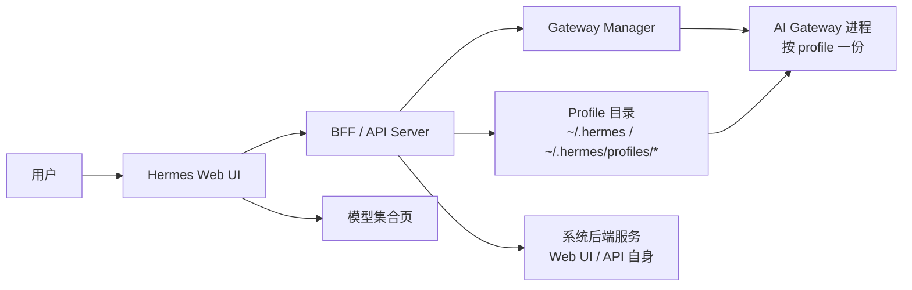
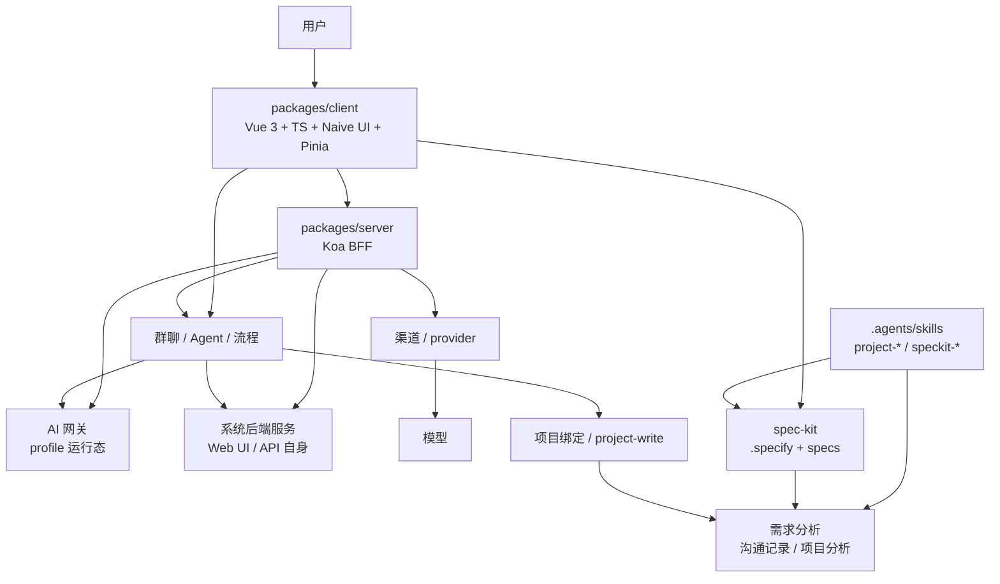

# 项目分析

## 项目定位
- Workflow Agent Hub 是当前对外产品名。
- 它是一个本地可运行的 AI 协作控制台。
- 核心对象是 `群聊`、`流程`、`模型`、`网关`、`项目绑定`。
- 当前重点已经从“聊天”扩展到“真实项目协作 + 流程驱动产出”。

## 长期品牌规则
- 对外展示层统一使用 `Workflow Agent Hub`。
- `Hermes Web UI`、`OPC Workspace` 不应继续作为用户可见品牌出现于首页、README、官网头尾、仓库元数据和高曝光文案中。
- 内部兼容性技术命名可暂时保留，例如：
  - `hermes/*` 代码模块
  - `/api/hermes/*` 路由
  - 兼容性的 CLI、环境变量、数据目录命名

## 当前能力
- 群聊支持多角色协作、流程节点、审批节点、产物归档。
- 已有网关管理、模型管理、系统设置等基础页面。
- 已开始接入“项目绑定”能力，允许群聊绑定一个真实本地代码仓库。
- 后端已具备按角色自动触发、产物同步、项目文件写入的基础逻辑。

## 网关与模型关系
- `AI 网关` 不是独立于 profile 的新实体，而是某个 profile 对应的网关运行态。
- 新增网关的真实动作是创建或克隆 profile，然后让该 profile 进入运行状态。
- 模型绑定不是“网关拥有多个模型”，而是“一个 profile 在某一时刻选择一个默认模型”。
- 不同 profile 可以各自选择不同模型，互不影响。
- 后端服务是 Web UI / API 自身的运行层，不属于 AI 网关，也不在网关页里创建。

## 产品布局建议
- 网关页应采用“左侧列表 + 右侧详情”的传统管理台形式。
- 列表负责快速浏览、筛选、选中网关。
- 详情区负责启停、查看日志、查看绑定模型；模型切换应留在 `模型管理` Tab，不放在网关运行态详情里。
- 当网关数量较多时，再考虑分页、搜索、状态筛选和按激活 profile 优先排序。
- 如果网关数量继续增长到十几个以上，列表区域应支持分页或虚拟滚动，但优先保持单页内的清晰操作路径。
- 同一页面上更适合用 `tabs` 区分 `网关 / 模型 / 关系` 三个职责区，而不是把所有能力压在一个面板里。
- `网关` tab 只管运行态和单个网关操作，`模型` tab 只管 Provider/集合，`关系` tab 只管绑定总览。
- `新增网关` 应放在 `网关` 区块内部，而不是挂在页面最外层，避免入口和页面主导航抢层级。
- `模型管理` 应独立成自己的内容区块，和 `网关管理` 同页但不混层。
- 原来的“配置管理”命名容易被误解为模型配置，应明确为 `Profile 管理`，并放在关系/绑定语境中。
- 默认 tabs 样式不够明显时，应使用卡片式二级导航，展示标题和简短说明。
- 当前“选择后的模型”写入的是目标 profile 的默认模型，其他 profile 仍可继续选择自己的模型，彼此不冲突。
- `已选中` 只应出现在左侧列表里，用来标记右侧详情对应哪一行；右侧详情不应重复展示，避免画蛇添足。
- 多个 AI 网关可以同时运行，运行态彼此独立；单聊按当前激活 profile 路由，群聊 Agent 按各自绑定 profile 路由。
- 页面上的状态检查操作只应重新拉取状态，不应重启网关、重发消息或改变绑定关系。
- `模型管理` 需要支持模型级软禁用：用户临时不用某个模型时可以禁用，模型不从配置中删除，后续可重新启用。
- 被软禁用的模型仍在模型管理中可见，但聊天模型选择器和群聊 Agent 模型选择应把它标记为不可选，避免误用。
- 模型软禁用入口应使用开关样式，并通过二次确认后再落状态，不能用藏在 tag 里的普通文字按钮。
- 渠道集合中的渠道也需要支持软禁用；禁用渠道不删除渠道和模型配置，但聊天/群聊选择器不再展示该渠道。
- 群聊 Agent 头像不能只让用户填写字符串，应提供可见的头像预设选择，同时保留 URL 输入作为高级入口。
- 流程模板应用应合并为一个决策入口：使用模板时让用户选择“仅应用流程”或“同时应用推荐 Agent”。
- 流程节点和阶段负责人应绑定到已添加 Agent；保存时仍同步 Agent 昵称到旧的负责角色字段，保持旧流程兼容。
- 流程模板和推荐 Agent 是两个不同层级：模板流程定义节点、产物和提示词，推荐 Agent 定义执行者配置。
- 仅应用流程时，系统必须校验当前群聊是否已有足够 Agent 覆盖流程所需角色；缺失时阻止保存。
- 同时应用推荐 Agent 时，系统可以批量添加模板 Agent，但不能覆盖用户已有同名同 profile Agent。
- 流程阶段和画布节点都应保存 `assignedAgentId`；`roleName` 只作为显示和旧逻辑兼容字段。
- 后端执行层在触发当前流程节点时应优先使用 `assignedAgentId` 找到 Agent，找不到时再回退到 `roleName`。

## 关键结构
- 前端主入口在 `packages/client`
- 后端主入口在 `packages/server`
- 群聊流程在 `packages/server/src/services/hermes/group-chat`
- 项目绑定服务在 `packages/server/src/services/hermes/project`
- 现有分析文档在 `docs/analysis`
- 项目级 Agent 入口在 `AGENTS.md`
- 项目本地 skills 在 `.agents/skills`
- spec-kit 工作区在 `.specify`
- 后续正式需求规格沉淀在 `specs`
- 需求沟通记忆沉淀在 `需求分析`
- spec-kit 命令入口已接到 `package.json`：
  - `pnpm spec:new -- "功能名称"`
  - `pnpm spec:plan -- specs/001-feature`
  - `pnpm spec:tasks -- specs/001-feature`
  - `pnpm spec:checklist -- specs/001-feature requirements`
  - `pnpm spec:doctor`
- 还补充了 5 类高价值项目 skill：
  - `project-codebase-onboarding`
  - `project-code-review`
  - `project-technical-writing`
  - `project-security-review`

## Agent 协作底座
- 本项目已接入 `/Users/bing/MySelf/AI/SKILLS/Agents` 的 `spec-kit + skills + AGENTS` 协作底座。
- 任何会改变代码、配置、脚本、文档、产品行为或交付行为的任务，都应先经过需求分析和范围确认。
- 通用流程由 `.agents/skills/speckit-*` 维护，项目专属约束由 `.agents/skills/project-*` 维护。
- spec-kit 负责正式需求工件：`spec.md`、`plan.md`、`tasks.md`、`checklists/*`。
- `需求分析` 负责连续沟通记忆：用户关注点、产品边界、架构结论和后续风险。
- Hermes 领域对象变更必须使用 `project-hermes-domain-boundaries` 检查概念边界。
- 复杂需求进入开发前使用 `project-tech-solution` 输出可执行技术方案。
- 实现阶段使用 `project-code-generation` 约束复用、分层、类型、错误处理和自检。
- 前端页面、交互、状态或布局变化后使用 `project-frontend-testing` 做自测收口。
- 每轮需求沟通结束后必须使用 `project-demand-memory` 写回 `需求分析/沟通记录.md`；当长期产品边界变化时，同步更新本文件。
- 交付前应使用 `project-test-and-report` 收口验证，默认优先执行 `pnpm exec vue-tsc -b` 和 `pnpm build`。

## 现阶段流程
- 需求进入群聊后，会自动触发 `需求分析师` -> `设计师` -> `架构师` -> `后端开发` -> `前端开发` -> `QA`
- 每个节点都应产出明确交付物。
- `project-write` 节点要求输出真实文件块，不能只写文档。
- 绑定项目后，后端/前端节点应该把文件写入真实仓库，而不是只留在群聊产物里。

## 已发现风险
- AI 容易把项目路径写错，尤其是根目录和真实模块目录混淆。
- AI 容易用模板覆盖已有配置文件，导致丢失原始配置。
- 仅靠提示词不够，必须在服务端写入层增加保护。
- 当前流程里审批、触发、写文件是分离的，容易出现“看起来完成了，实际上没改代码”的假完成。

## 当前建议
- 绑定项目路径和真实目录结构要在提示词中显式展示。
- 对已有配置文件做最小增量写入校验。
- 后端节点优先写新增文件，不要先碰关键配置。
- 每次需求沟通后，把“需求结论 + 风险点 + 下一步动作”追加到沟通记录里。

## 当前结论
- 项目已经具备从“聊天产物”走向“真实代码变更”的基础。
- 现在最重要的是把写文件规则收紧，避免错误路径和误覆盖。

## 补充结论 2026-05-30：应用首页的产品职责继续收口

在应用工作台主线逐步稳定后，`Applications` 首页的职责需要进一步明确：

- 它不是简单的应用列表页
- 它应该成为外部用户进入产品后的第一层分流判断台

### 为什么要这样定义

对于外部用户来说，进入系统后的首要问题通常不是：

- 有没有这个功能
- 哪个页面配置最全

而是：

- 现在先处理哪条应用
- 这条应用为什么最值得先开
- 打开后应该直接去哪个分区继续推进

如果首页不承担这层职责，用户就仍然需要自己理解应用状态、运行边界和各分区作用，产品入口会继续偏“后台目录”而不是“真实工作台”。

### 当前建议的首页判断模型

应用首页优先围绕“推进风险与下一步确定性”做排序，而不是只按最近更新时间：

1. 等待审核
2. 最近失败
3. 正在正式执行
4. 已 ready 可正式启动
5. 仍需补齐起始配置

这样首页顶层就能帮助用户快速做出“先去哪”的决定，而不是把判断成本压回给用户。

### 当前产品边界补充

- 首页主判断卡负责：
  - 说出最值得先打开的应用
  - 说明原因
  - 给出直接动作入口
- 应用卡负责：
  - 继续展示对象信息
  - 同时暴露当前优先级类型
  - 提示最适合先进入的分区
- 详情页负责：
  - 承接进入后的真实操作和作用域治理

### 对后续页面的启发

这轮进一步说明，后面所有高曝光页面都应该优先自查三件事：

- 这个页面是不是在帮助用户先做判断
- 当前主入口会不会把用户直接带到最合理的下一步
- 页面是在列功能，还是在帮用户推进真实工作

## 补充结论 2026-05-31：legacy 页面应升级为辅助判断页

随着应用首页和执行看板逐步承担主工作台入口职责，legacy 页面也需要重新定义：

- 它们不再适合继续作为原始后台工具页存在
- 但也不应该硬改成主工作台

更合适的角色是：

- 辅助判断页

### 当前适用边界

- `Logs`
  - 用于确认运行底座、网关、provider、会话链路或系统服务到底发生了什么
  - 不适合直接承担应用推进
- `Usage`
  - 用于观察执行量、模型结构、缓存效率与成本趋势
  - 不适合解释单条应用失败原因

### 为什么这样定义

如果这些页面继续只暴露原始工具能力，就会出现两个问题：

- 用户知道这里“能看很多东西”，但不知道自己为什么现在该来
- 用户看完后也不知道下一步应该回哪个主页面继续处理

这会把产品再次拉回“后台控制台”心智，而不是“面向真实工作的应用工作台”。

### 当前页面设计原则补充

对于这类 legacy / system surface，更合适的结构是：

1. 顶部先说明职责与适用场景
2. 中间先给判断信号与摘要
3. 下方再保留原始工具能力作为证据层
4. 页面内要给出明确的回流入口

### 对后续范围的启发

后续继续收口页面时，除了问“有没有这个功能”，还要继续追问：

- 这个页面是在推进工作，还是在辅助判断
- 它有没有先说明自己为什么值得来
- 它有没有告诉用户看完之后应该回哪一层继续处理

## Jobs / Kanban / Memory 页面分层补充

在 `Applications / Runs` 已承担主工作台入口、`Logs / Usage` 已承担辅助判断页、`Profiles / Channels` 已承担共享治理入口后，这一轮继续把另外三类高曝光页面纳入同一套分层体系：

- `Jobs`
  - 定位为“自动推进治理面”
  - 负责定时任务、自动巡检、周期跟进、自动触发的治理
  - 与 `Runs` 的边界：
    - `Runs` 看单次执行现场
    - `Jobs` 看会持续自动发生的执行节奏
- `Kanban`
  - 定位为“跨应用协同面”
  - 负责跨应用、跨机器人、跨角色的共享任务排队与阻塞处理
  - 与 `Applications / Runs` 的边界：
    - `Applications` 负责单个应用整体推进
    - `Runs` 负责单次执行现场
    - `Kanban` 负责这些对象之间的协同事项
- `Memory`
  - 定位为“共享上下文治理面”
  - 负责长期生效、会影响多个应用和机器人的共享记忆
  - 与应用上下文/运行上下文的边界：
    - 单次任务说明放到应用、run、任务现场
    - 长期复用的人设、偏好、长期约束才进入 `Memory`

### 当前页面设计原则再次收敛

经过这一轮后，当前系统里的高曝光页面分层更清晰了：

1. 主工作台入口
   - `Applications`
   - `Runs`
2. 辅助判断页

## 补充结论 2026-06-08：工作台首页与应用页分层规则

随着应用数量持续增长，`Applications` 页不应继续承担首页概览职责，而应明确回到“应用集合管理台”。

### 当前长期规则

- `Overview`
  - 是工作台默认首页
  - 负责跨应用判断
  - 暴露待审核、失败、运行中、可启动、最近活动等全局信号
- `Applications`
  - 负责应用集合浏览与操作
  - 优先保证高密度浏览、搜索、筛选和快速进入
  - 不再放大面积“优先处理/待审核/首页判断”区块

### 页面职责边界

- 当页面目标是回答“现在先处理什么”时，应优先进入 `Overview`
- 当页面目标是回答“我要管理哪条应用、从哪条应用继续”时，应进入 `Applications`
- `Applications` 页可以保留轻量摘要，但不能让摘要压缩主应用区

### 导航与入口规则

- 登录后默认进入 `Overview`
- 侧边栏中 `Overview` 与 `Applications` 应并列存在
- 从 `Overview` 进入 `Applications` 时，可以携带焦点筛选，但不应把 `Applications` 再变回概览页

## 补充结论 2026-06-12：未来需支持 API-first 的分布式执行编排网络

当前项目虽然仍以本地工作台为主，但未来产品方向已经明确不应停留在“单机 + 单套本地运行时”。

### 长期目标

系统未来应支持：

- 多个远程或本地执行节点接入
- 通过 API 统一注册、发现、调度和治理
- 每个节点尽量轻量接入，不要求完整部署沉重框架
- 不同执行体、不同模型来源、不同 skill、不同 workflow 可在统一平台内组合

### 新的长期分层

后续做架构和页面设计时，应逐步按以下五层理解系统：

1. 算力与模型层
   - 渠道 / provider
   - 模型
   - 本地 Ollama / 远程 API
2. Agent 执行层
   - Hermes
   - 龙虾
   - Claude CLI
   - 其他可注册执行器
3. Skill 能力层
   - coding
   - 生图
   - 短视频
   - 软文
   - 其他能力模板
4. Workflow 编排层
   - 用户可自定义编排
   - 由 skill、agent、审批、产物构成
5. 调度与运维层
   - 注册
   - 心跳
   - 可用性
   - 负载
   - 调度
   - 运维治理

### 当前边界补充

- `渠道 / provider`
  - 仍表示模型来源、密钥、base URL 和渠道级开关
- `模型`
  - 仍表示具体算力单元
- `AI 网关`
  - 当前仍是 profile 对应的运行态，不应直接和未来“分布式执行节点”混为一个对象
- 未来新增概念：
  - `执行器 / Agent Runtime`
    - 是一个可注册、可调度、可治理的执行节点
    - 可以承载 Hermes、Claude CLI、龙虾等不同后端
  - `Skill`
    - 是能力语义层，不等于模型，也不等于执行器
  - `Workflow`
    - 是组合 skill、执行器和审批规则的编排层

### 设计约束

- 不能默认要求每个工作节点都完整部署重型框架
- 最小接入形态应允许：
  - 一个 CLI
  - 一个 connector
  - 或一个轻量 agent runtime
- 平台控制面要优先考虑 API-first，而不是 UI-first 或 CLI-first
- 运维流程必须成为正式设计对象，不能只考虑“能跑起来”，还要考虑：
  - 节点注册
  - 在线状态
  - 能力声明
  - 调度目标选择
  - 利用率与失败治理

### 对现有系统的启发

这意味着未来不能只把系统理解成：

- Web UI
- profile
- gateway
- model
- group chat

而需要逐步升级为：

- 控制面
- 模型算力面
- 执行器网络
- skill 能力市场
- workflow 编排面
- 运维调度面

后续如果进入这条方向的正式方案阶段，应优先先出对象模型与 API 边界，而不是直接进入页面实现。
   - `Logs`
   - `Usage`
3. 共享治理入口
   - `Profiles`
   - `Channels`
   - `Memory`
4. 专项治理 / 协同面
   - `Jobs`
   - `Kanban`

这说明后续继续打磨现有系统时，不应再简单以“导航上一页就是一个功能模块”的方式理解页面，而应优先确认：

- 它是主推进入口，还是治理面
- 它是在看单对象，还是跨对象协同
- 它是在做即时执行，还是长期治理
- 它是否已经明确告诉用户“看完之后去哪”

## Skills 页面分层补充

这一轮继续收口后，`Skills` 的产品定位也更明确了：

- `Skills`
  - 定位为“共享能力治理入口”
  - 负责治理平台当前可用的共享 skills 基线
  - 关注：
    - 哪些共享能力已修改
    - 哪些共享能力已停用
    - 哪些能力仅保留为归档
    - 当前平台能力来源如何分布

### 与其他层的边界

- 与 `Applications`
  - `Applications` 负责单条应用推进
  - `Skills` 负责共享能力基线，不直接推进单条应用
- 与 `Group Chat / Agents`
  - `Group Chat` 负责协作现场
  - `Skills` 负责这些协作现场背后可复用的共享能力
- 与 `Runs`
  - `Runs` 看单次执行结果
  - `Skills` 看这些执行背后的共享能力组成是否需要治理

### 当前高曝光页面分层再补充

经过这一轮后，高曝光页面分层进一步完善为：

1. 主工作台入口
   - `Applications`
   - `Runs`
2. 辅助判断页
   - `Logs`
   - `Usage`
3. 共享治理入口
   - `Profiles`
   - `Channels`
   - `Memory`
   - `Skills`
4. 专项治理 / 协同面
   - `Jobs`
   - `Kanban`

这进一步说明，后续页面设计不能只看“有没有对应功能”，还要优先确认：

- 这是共享基线治理，还是业务推进
- 是结果验证页，还是能力配置页
- 是长期能力层，还是一次性执行层

## Files 页面分层补充

这一轮继续收口后，`Files` 的产品定位也更明确了：

- `Files`
  - 定位为“共享文件工作面”
  - 负责承接运行工作区里的真实文件层操作
  - 关注：
    - 当前目录里真实有哪些文件与子目录
    - 哪些文件可直接预览或编辑
    - 当前是否有未保存改动会影响现场连续性
    - 是否需要把附件、脚本、配置补进工作区

### 与其他层的边界

- 与 `Resources`
  - `Resources` 负责结果资产和交付产出
  - `Files` 负责运行工作区里的真实文件现场
- 与 `Applications`
  - `Applications` 负责单条应用的流程推进与下一步判断
  - `Files` 负责流程背后的文件层实际内容维护
- 与 `Runs`
  - `Runs` 负责单次执行现场与结果验证
  - `Files` 负责执行过程中实际依赖的脚本、配置与附件文件
- 与 `Terminal`
  - `Terminal` 负责更专业的命令行操作
  - `Files` 负责更直观、可视化的文件层进入方式

### 当前高曝光页面分层再补充

经过这一轮后，高曝光页面分层进一步完善为：

1. 主工作台入口
   - `Applications`
   - `Runs`
2. 辅助判断页
   - `Logs`
   - `Usage`
3. 共享治理入口
   - `Profiles`
   - `Channels`
   - `Memory`
   - `Skills`
4. 共享工作面 / 真实现场层
   - `Files`
5. 专项治理 / 协同面
   - `Jobs`
   - `Kanban`

这进一步说明，后续设计页面时不能只看“有没有功能”，还要先确认：

- 这是结果资产层，还是运行现场层
- 这是共享治理入口，还是具体工作面
- 它是否先告诉用户什么时候值得进入
- 它是否明确给出看完后回哪一层继续推进

## History 页面分层补充

这一轮继续收口后，`History` 的产品定位也更明确了：

- `History`
  - 定位为“运行档案与复盘证据页”
  - 负责承接不同来源留下的历史运行记录回看
  - 关注：
    - 哪些历史记录值得复盘
    - 不同来源留下了什么上下文
    - 哪些记录值得导出或固定保留
    - 哪些记录带有工作区线索，适合继续追溯真实现场

### 与其他层的边界

- 与 `Chat`
  - `Chat` 负责实时协作与继续对话
  - `History` 负责只读回看已经发生过的运行记录
- 与 `Runs`
  - `Runs` 负责当前单次执行现场与下一步推进
  - `History` 负责回看历史执行留下的证据与上下文
- 与 `Applications`
  - `Applications` 负责单条应用整体推进
  - `History` 负责提供历史证据，帮助用户在回流前看清之前发生过什么

### 当前高曝光页面分层再补充

经过这一轮后，高曝光页面分层可以进一步细化为：

1. 主工作台入口
   - `Applications`
   - `Runs`
2. 辅助判断页
   - `Logs`
   - `Usage`
3. 共享治理入口
   - `Profiles`
   - `Channels`
   - `Memory`
   - `Skills`
4. 共享工作面 / 真实现场层
   - `Files`
5. 运行档案 / 复盘证据层
   - `History`
6. 专项治理 / 协同面
   - `Jobs`
   - `Kanban`

这进一步说明，后续设计页面时不仅要区分“治理”和“推进”，还要额外区分：

- 这是实时现场，还是历史档案
- 这是结果判断页，还是证据回看页
- 它是否告诉用户看完后该回哪一层继续推进

## Models 页面分层补充

这一轮继续收口后，`Models` 的产品定位也更明确了：

- `Models`
  - 定位为“共享模型能力治理页”
  - 负责治理平台当前共享模型能力基线
  - 关注：
    - 当前默认模型与默认渠道是否就绪
    - 哪些 provider 或模型被停用
    - 是否需要补充自定义 provider
    - 共享模型能力是否足以支撑聊天、群聊和后续应用执行

### 与其他层的边界

- 与 `Applications`
  - `Applications` 负责单条应用整体推进
  - `Models` 负责这些应用背后共享模型能力是否准备好
- 与 `Runs`
  - `Runs` 负责单次执行现场与结果验证
  - `Models` 负责执行前共享模型路由和能力基线是否成立
- 与 `Gateways`
  - `Models` 负责模型能力与默认路由基线
  - `Gateways` 更偏运行接线、进程状态和健康治理

### 当前高曝光页面分层再补充

经过这一轮后，高曝光页面分层可进一步细化为：

1. 主工作台入口
   - `Applications`
   - `Runs`
2. 辅助判断页
   - `Logs`
   - `Usage`
3. 共享治理入口
   - `Profiles`
   - `Channels`
   - `Memory`
   - `Skills`
   - `Models`
4. 共享工作面 / 真实现场层
   - `Files`
5. 运行档案 / 复盘证据层
   - `History`
6. 专项治理 / 协同面
   - `Jobs`
   - `Kanban`

这进一步说明，后续设计页面时还要继续区分：

- 这是共享能力基线，还是运行接线层
- 这是执行现场，还是执行前的能力准备层
- 它是否告诉用户改完后回哪一层去验证

## Gateways / Settings / Group Chat 页面分层补充

这一轮继续收口后，`Gateways`、`Settings`、`Group Chat` 的产品定位也更明确了：

- `Gateways`
  - 定位为“运行接线与健康治理页”
  - 负责治理：
    - profile 运行接线
    - 网关启停和健康状态
    - 群聊 Agent 绑定到哪组 gateway
    - 后端服务异常和网关接线异常的分层判断
- `Settings`
  - 定位为“系统偏好治理页”
  - 负责治理：
    - 显示方式
    - 会话重置习惯
    - 记忆和隐私策略
    - 审批模式
    - 平台级偏好与入口配置
- `Group Chat`
  - 定位为“共享协作现场”
  - 负责承接：
    - 房间
    - Agent
    - 成员
    - 项目绑定
    - 工作流运行
    - 现场产物和实时协作消息流

### 与其他层的边界

- `Gateways` 与 `Models`
  - `Models` 负责共享模型能力基线
  - `Gateways` 负责这些能力是否真正接到了运行态
- `Settings` 与 `Gateways / Models`
  - `Settings` 负责系统级偏好
  - 不负责共享模型能力基线，也不负责运行接线与健康
- `Group Chat` 与 `History`
  - `Group Chat` 负责实时协作现场
  - `History` 负责已发生运行的只读档案和复盘证据
- `Group Chat` 与 `Applications / Runs`
  - `Applications` 负责业务入口与整体推进
  - `Runs` 负责单次执行与结果验证
  - `Group Chat` 负责多人 / 多 Agent 围绕真实项目持续协作的现场层

### 当前高曝光页面分层再补充

经过这一轮后，高曝光页面分层可进一步细化为：

1. 主工作台入口
   - `Applications`
   - `Runs`
2. 辅助判断页
   - `Logs`
   - `Usage`
3. 共享治理入口
   - `Profiles`
   - `Channels`
   - `Memory`
   - `Skills`
   - `Models`
   - `Gateways`
   - `Settings`
4. 共享工作面 / 真实现场层
   - `Files`
5. 运行档案 / 复盘证据层
   - `History`
6. 共享协作现场
   - `Group Chat`
7. 专项治理 / 协同面
   - `Jobs`
   - `Kanban`

这进一步说明，后续页面设计时还要继续区分：

- 这是共享基线治理，还是运行现场
- 这是运行接线层，还是系统偏好层
- 这是实时协作现场，还是历史复盘层
- 它是否明确告诉用户改完后应回哪一层继续推进或验证

## Chat / Profiles 页面分层补充

这一轮继续收口后，`Chat` 与 `Profiles` 的产品定位也更明确了：

- `Chat`
  - 定位为“单人实时协作现场”
  - 负责承接：
    - 单人实时往返
    - 当前会话即时推进
    - 临时工作区挂接
    - 快速提示试验与模型响应验证
- `Profiles`
  - 定位为“共享运行身份治理页”
  - 负责治理：
    - 当前 active profile
    - 共享默认模型归属
    - 环境隔离基线
    - 不同应用族可复用的运行身份体系

### 与其他层的边界

- `Chat` 与 `History`
  - `Chat` 负责单人实时现场
  - `History` 负责历史运行档案和复盘证据
- `Chat` 与 `Group Chat`
  - `Chat` 负责单人实时往返
  - `Group Chat` 负责多人 / 多 Agent 持续协作现场
- `Profiles` 与 `Gateways`
  - `Profiles` 负责运行身份基线
  - `Gateways` 负责这些身份是否真的接到了运行态
- `Profiles` 与 `Applications`
  - `Profiles` 负责共享运行默认项
  - `Applications` 负责单条业务对象推进

### 当前高曝光页面分层再补充

经过这一轮后，高曝光页面分层可进一步细化为：

1. 主工作台入口
   - `Applications`
   - `Runs`
2. 实时现场层
   - `Chat`
   - `Group Chat`
3. 辅助判断页
   - `Logs`
   - `Usage`
4. 共享治理入口
   - `Profiles`
   - `Channels`
   - `Memory`
   - `Skills`
   - `Models`
   - `Gateways`
   - `Settings`
5. 共享工作面 / 真实现场层
   - `Files`
6. 运行档案 / 复盘证据层
   - `History`
7. 专项治理 / 协同面
   - `Jobs`
   - `Kanban`

这进一步说明，后续页面设计时还要继续区分：

- 这是单人实时现场，还是多人协作现场
- 这是共享运行身份层，还是运行接线层
- 这是档案回看层，还是即时推进层
- 它是否明确告诉用户看完后该回哪一层继续推进

## 当前架构图

## 总体协作图

